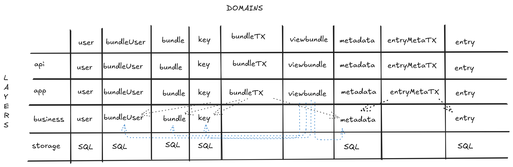

# PwManager

pwmanager is a secure and user-friendly password manager featuring a single-page application (SPA) frontend, a Go-based backend service, and PostgreSQL for persistent storage.

# Domain Diagram

