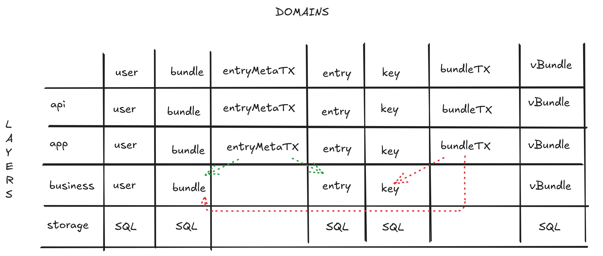

# PwManager

pwmanager is a secure and user-friendly password manager featuring a single-page application (SPA) frontend, a Go-based backend service, and PostgreSQL for persistent storage.

# Domain Diagram

| Domain Name   | Description                                                                                                          |
| ------------- | -------------------------------------------------------------------------------------------------------------------- |
| `user`        | Represents users and user specific data like encrypted encryption keys.                                              |
| `bundle`      | A collection of password entries grouped together, typically associated with a specific user or purpose.             |
| `key`         | A key is the bundle symmetric key encrypted with a user's public key.                                                |
| `entry`       | Individual password entries (e.g. username and password), stored encrypted using the bundle symmetric key.           |
| `bundletx`    | The domain responsible for creating a bundle; the bundle and its corresponding key must be created at the same time. |
| `entrymetatx` | The domain that creates entries. An entry is a password entry. Metadata is the updated bundle metadata.              |
| `vbundle`     | The domain that returns the users bundles and associated data (e.g. keys, usernames) by querying a SQL view          |
